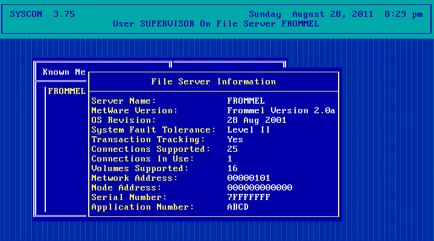
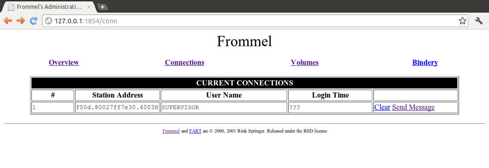

# Introduction

Once upon a time, there was [MS-DOS](https://en.wikipedia.org/wiki/MS-DOS). While being very useful for its time, it did not have decent network storage abilities, such a something remotely simular to Sun's Network File System. However, [Novell NetWare 3.12](https://en.wikipedia.org/wiki/Novell_NetWare) solved all these problems.
 
However, there was a problem for me. I was still living at my parents house (we are talking 1998 or so here), and I had a single server, which was a [FreeBSD](https://www.FreeBSD.org) machine. I was frequently using DOS, and could never really transfer files. That is why I coded Frommel (this was intended to be an acronym of Fast, Reliable, Opensource ... but I never could settle on anything), which was a Novell 3.12-compitable server daemon for FreeBSD. mars_nwe had a FreeBSD port at that time, but it had so many issues that I never really cared about actually using it.

## Frommel

Frommel was quite feature-rich, especially considering I coded this to replace mars_nwe. It supported:

  * Bindery (Novell database for users/groups/etc) emulation<
  * Multiple bindery backends (MySQL, PostgreSQL, binary file etc
  * Web interface
  * Trustee (ACL) implementation
  * Unfinished server linking (clustering) implementation

It also had a quite modular structure, as it consisted of several subsystems:

  * Frommel network server itself
  * GASP, used for remote console commands, but also servering linking (clustering)
  * FART, web administration tool
  * RCONSOLE, used for NetWare-compitable remote console messages (never finished due to suspected bugs in the FreeBSD SPX code)

## Screenshots

### Novell's SYSCON utility identifying a Fromel server

### Frommel's web-based administration tool

## Downloads

  * [Full source code](releases/frommel.tar.bz2) (136KB)
